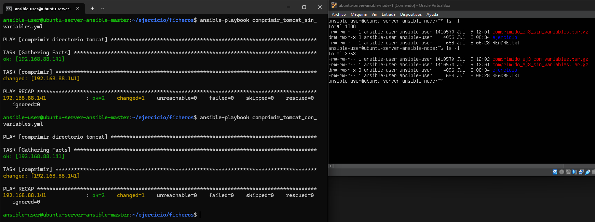
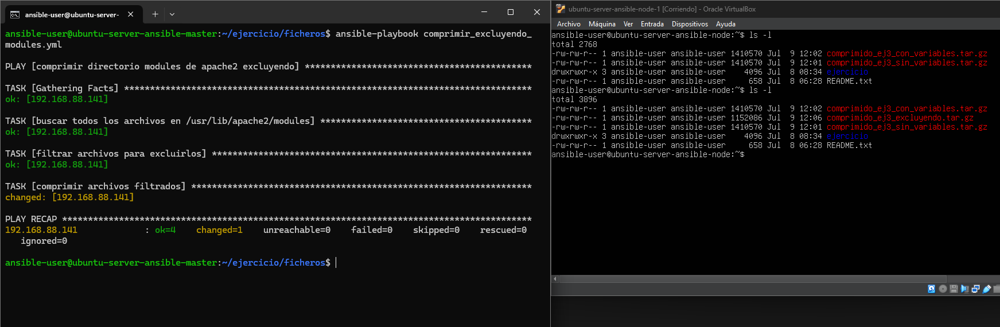
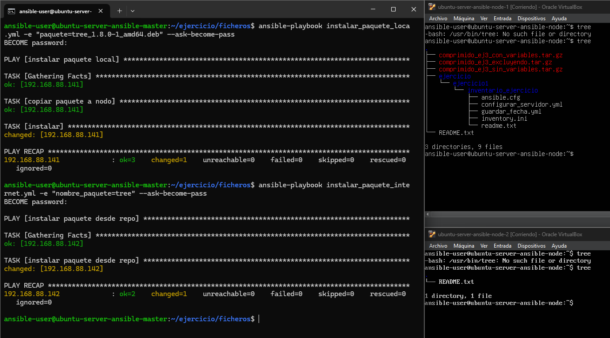

# Ejercicio 3

comprimir directorio sin variables, ejecuto el playbook así: `ansible-playbook comprimir_tomcat_sin_variables.yml`

comprimir directorio usando variables para las rutas, ejecuto el playbook así: `ansible-playbook comprimir_tomcat_con_variables.yml -e "`

estos son los logs para ambos playbooks:

para ejecutar el playbook que comprime excluyendo archivos uso: `ansible-playbook comprimir_excluyendo_modules.yml`
estos son los logs:

para instalar un paquete local, lo primero que hice fue descargar el paquete en mi máquina usando este comando:
`curl -O http://ftp.de.debian.org/debian/pool/main/t/tree/tree_1.8.0-1_arm64.deb`
una vez descargado, ejecuto el playbook de esta forma:
`ansible-playbook instalar_paquete_loca.yml -e "paquete=tree_1.8.0-1_amd64.deb" --ask-become-pass`
para instalarlo desde un repo remoto solo necesito ejecutar el playbook de esta forma:
`ansible-playbook instalar_paquete_internet.yml -e "nombre_paquete=tree" --ask-become-pass`

estos son los logs de ambos playbooks:

