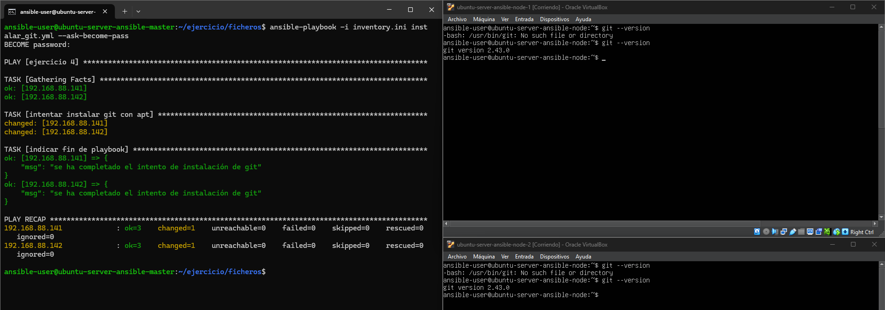
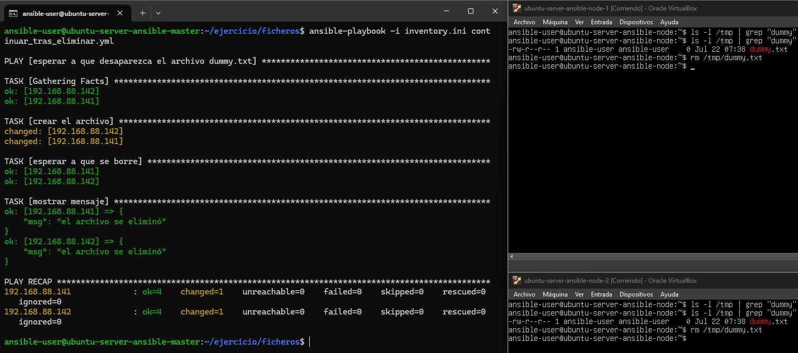

# Ejercicio 4

para la parte 1, instalar git, ejecuto el playbook "instalar_git.yml" de la siguiente manera: 
`ansible-playbook comprimir_tomcat_sin_variables.yml`

el resultado es el siguiente:

para la parte 2, continuar tras eliminar un fichero, ejecuto el playbook "continuar_tras_eliminar.yml" de la siguiente manera:
`ansible-playbook -i inventory.ini continuar_tras_eliminar.yml`
